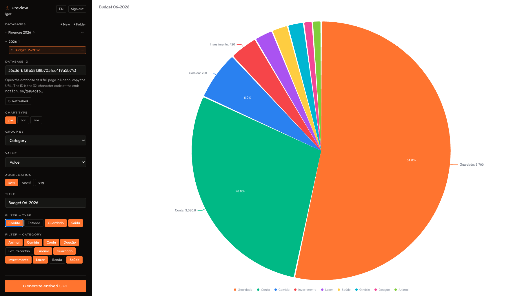
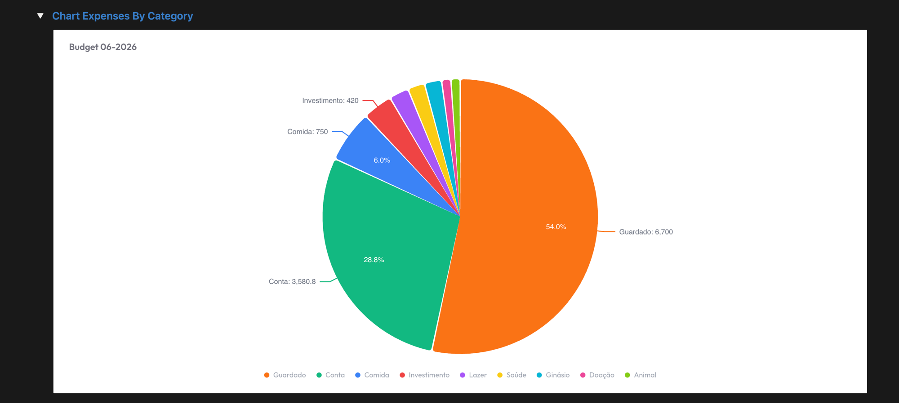

<div align="center">
  
  <h1>notion-graphs</h1>
  <p>Turn any Notion database into an embeddable chart.</p>
</div>

---

## Screenshots


<br />



<br />



---

## Overview

Connect your Notion workspace via OAuth, pick a database, configure a chart, and get a signed `/embed/<token>` URL to paste back into Notion as an embed block. Each user's token is stored encrypted; each embed URL is HMAC-signed so it can't be forged.

**Stack:** Next.js 16 (App Router, React 19) · Notion SDK v5 (OAuth) · Neon Postgres + Drizzle · Recharts · Tailwind v4

## Features

- Per-user Notion OAuth — each visitor connects their own workspace
- Aggregate rows by any property (group + sum / count / avg)
- Pie, bar, and line charts
- Filters for `Type` / `Category` properties with live preview
- Signed `/embed/<token>` URLs, iframe-friendly (`frame-ancestors *`)
- ISR (`revalidate = 60 × 60 × 24`) + per-user cache isolation
- EN / PT-BR UI

> **Before external users can connect**, your public integration needs Notion's review approval. Until then only workspaces you own can authorize the app.

---

## Setup

### 1. Clone & install

```bash
pnpm install
cp .env.local.example .env.local
```

### 2. Generate secrets

```bash
openssl rand -hex 32   # EMBED_SECRET
openssl rand -hex 32   # SESSION_SECRET
openssl rand -hex 32   # ENCRYPTION_KEY
```

Paste each value into `.env.local`.

### 3. Create a Neon project

Sign up at [neon.tech](https://neon.tech), create a project, copy the pooled connection string into `DATABASE_URL`.

### 4. Create a Notion public integration

1. Go to [notion.so/my-integrations](https://www.notion.so/my-integrations) → **New integration** → type **Public**.
2. Fill in company/site/privacy/ToS URLs (any public URL works during dev).
3. Under **Redirect URIs**, add `http://localhost:3000/api/auth/notion/callback` (and your prod URL once deployed).
4. Copy the OAuth **Client ID** and **Client secret** into `.env.local`.

Your `.env.local` should look like:

```
NOTION_CLIENT_ID=...
NOTION_CLIENT_SECRET=...
DATABASE_URL=postgres://...
EMBED_SECRET=...
SESSION_SECRET=...
ENCRYPTION_KEY=...
NEXT_PUBLIC_BASE_URL=http://localhost:3000
```

### 5. Apply the DB schema

```bash
pnpm db:push
```

### 6. Run

```bash
pnpm dev
```

Open <http://localhost:3000> → **Connect Notion** → authorize → you land on `/preview`.

---

## Building a chart

In `/preview`, paste a Notion database ID (the 32-char hex from `notion.so/…/<DB-ID>`). Use the sidebar to:

- Pick chart type: **pie / bar / line**
- Choose **Group by** and **Value** properties
- Pick aggregation: **sum / count / avg**
- Toggle filters for `Type` / `Category`
- Set an optional title

Click **Generate embed URL** — the sidebar shows the signed URL ready to copy.

> The database must be shared with your integration: open it in Notion → `···` → **Connections** → add your integration.

### Embed in Notion

Paste the **URL** (not the `<iframe>`) into a Notion page → **Create embed**.

> ⚠️ Notion blocks `http://localhost` iframes. For local iteration, use `/preview` directly — only paste embed URLs into Notion after deploying to HTTPS.

---

## Deploy

```bash
vercel
```

In Vercel's dashboard:

1. Add every variable from `.env.local.example`.
2. Set `NEXT_PUBLIC_BASE_URL` to your production origin.
3. Add `https://<host>/api/auth/notion/callback` as a redirect URI on the Notion integration.
4. Run `pnpm db:push` against the production `DATABASE_URL` (or use `pnpm db:generate` + `pnpm db:migrate`).

---

## Commands

| Command | Description |
| --- | --- |
| `pnpm dev` | Dev server on :3000 |
| `pnpm build` / `pnpm start` | Production build + serve |
| `pnpm lint` | ESLint |
| `pnpm db:push` | Apply schema to `DATABASE_URL` |
| `pnpm db:generate` / `pnpm db:migrate` | Migration-based flow (prod) |
| `pnpm db:studio` | Drizzle Studio UI |

---

## How it works

```
Connect Notion (OAuth)  ──► users table (access token AES-256-GCM encrypted)
Signed session cookie   ──► requireUser() in server components
queryDatabase(userId,…) ──► unstable_cache (keyed per user + dbId)
                        ──► applyFilters → groupAndAggregate
                        ──► <ChartRenderer>  (Pie | Bar | Line)
```

For the full architecture — file-by-file responsibilities, cache-isolation invariants, and the embed-token codec — see [`CLAUDE.md`](./CLAUDE.md).

---

## Security notes

- Notion tokens are **AES-256-GCM encrypted** at rest. Losing `ENCRYPTION_KEY` bricks every stored credential; rotating it requires a re-encrypt migration.
- Embed URLs are unguessable but not private — anyone with the full URL can render the chart. The HMAC only prevents forging new URLs without `EMBED_SECRET`. **Don't embed sensitive data.**
- Rotating `EMBED_SECRET` invalidates every previously minted embed URL.
- Notion API rate limit (~3 req/s) is **per integration**, shared across all connected workspaces. The per-user `unstable_cache` is the main mitigation.
